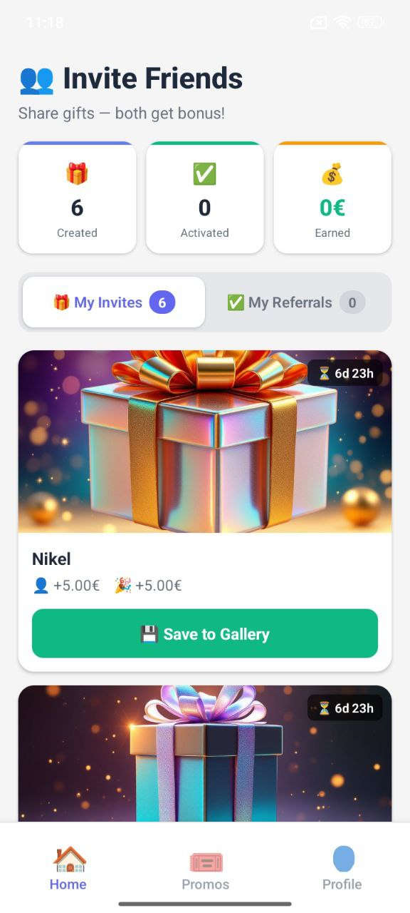

# DARY Platform

> **Note:** This repository contains documentation, architecture specs, and partial service modules. The full application source code is maintained in a private repository.

<div align="center">


</div>

> **B2B Lead Generation Platform with AI-Generated Personalized Gifts & Viral Referral System**

A full-stack SaaS platform designed to help brands acquire customers through AI-generated personalized gift images with embedded digital rewards and viral referral mechanics.

## 🎯 Project Overview

DARY is an innovative marketing platform that combines AI image generation, steganography, and gamification to create a viral customer acquisition engine for B2B brands.

### Core Concept

1. **Brand** creates an AI-powered campaign with personalized gift images
2. **User** receives a beautiful AI-generated artwork containing hidden tokens
3. User uploads the image to DARY platform
4. **Token extraction** via perceptual hashing (pHash) technology
5. User earns **DAR tokens** and receives referral invitations
6. User shares invitations with friends → **viral growth cycle**
7. Tokens redeemable for promotional codes in Brand Store

---

## 🚀 Key Features

### For Users (Web + Mobile)
- 📱 Receive and activate AI gift images
- 🎁 Earn DAR tokens for activations
- 🔗 Share up to 3 referral invitations per campaign
- 💰 Redeem tokens for promotional codes
- 🔔 Push notifications for gifts, referrals, and promotions

### For Businesses (Web Dashboard)
- 🎨 Create AI-powered marketing campaigns (5-step wizard)
- 💳 Manage campaign funding via integrated wallet
- 📊 Track leads, analytics, and viral coefficients
- 📈 Monitor conversion rates and campaign performance
- 📥 Export campaign data and lead information

### For Admins (Admin Panel)
- 🌍 DARY Universal dashboard for perpetual growth tracking
- 💼 Finance dashboard with commission monitoring
- ⚙️ Campaign moderation and conversion tools
- 📉 System-wide analytics and performance insights

---

## 🏗️ Technical Architecture

### Tech Stack

#### Frontend
| Technology | Purpose |
|------------|--------|
| **React 18** | Web application SPA |
| **React Router 6** | Client-side routing |
| **React Native 0.82** | Android mobile app |
| **React Navigation** | Mobile navigation |
| **Axios** | HTTP client |
| **react-i18next** | Internationalization (5 languages) |
| **Vision Camera** | Mobile camera for gift scanning |
| **Chart.js / Recharts** | Business analytics dashboards |

#### Backend
| Technology | Purpose |
|------------|--------|
| **Node.js 18** | Runtime environment |
| **Express 4.x** | REST API framework |
| **PostgreSQL 15** | Primary database (45 tables) |
| **JWT** | Authentication (access + refresh tokens) |
| **bcrypt** | Password hashing |
| **express-validator** | Input validation |
| **Swagger/OpenAPI** | API documentation |
| **node-cron** | Scheduled tasks |
| **multer** | File upload handling |

#### AI & Image Processing
| Technology | Purpose |
|------------|--------|
| **FLUX 1.1-pro** | AI portrait generation for B2B campaigns |
| **FLUX kontext-pro** | Abstract AI art generation |
| **pHash v2.0** | Perceptual hashing for image recognition |
| **Steganography (LSB)** | Token embedding in images (legacy v1) |
| **Cloudinary** | Image storage, CDN, transformations |

> **Note:** The pHash system handles image compression from WhatsApp/Telegram, ensuring robust token extraction even after social media compression.

#### External Integrations
| Service | Purpose |
|---------|--------|
| **Stripe** | Payment processing (EUR), subscriptions |
| **Firebase Cloud Messaging** | Push notifications (Android) |
| **Replicate** | AI model hosting and execution |

---

## 📁 Project Structure

```
DARY/
├── backend/              # Node.js + Express API
│   ├── routes/          # 18 route modules (150+ endpoints)
│   │   ├── authRoutes.js
│   │   ├── brandGiftsRoutes.js
│   │   ├── referralsRoutes.js
│   │   ├── campaignRoutes.js
│   │   └── ...
│   ├── services/        # Business logic layer
│   │   ├── ReferralService.js
│   │   ├── BrandGiftService.js
│   │   ├── PHashService.js
│   │   └── ...
│   ├── server.js
│   └── swagger.js
│
├── dashboard/           # React 18 Web App
│   ├── src/
│   │   ├── components/  # Reusable UI components
│   │   ├── pages/       # User/Business/Admin pages
│   │   └── locales/     # i18n translations (5 languages)
│   └── App.js
│
├── mobile/              # React Native Android App
│   ├── src/
│   │   ├── screens/     # App screens
│   │   ├── navigation/  # React Navigation config
│   │   ├── services/    # API + Firebase integration
│   │   └── locales/     # Mobile translations
│   └── android/
│
└── docs/                # Technical documentation (10 parts)
```

---

## 🔐 Security

- **JWT Authentication** with access (24h) and refresh (30d) tokens
- **Role-Based Access Control (RBAC)** with 3 permission levels
- **bcrypt password hashing** (10 salt rounds)
- **CORS** whitelisted domains
- **Rate limiting** (100 req/min)
- **Input validation** on all endpoints
- **HttpOnly cookies** (web) + **SecureStore** (mobile)

---

## 🌍 Internationalization

Full localization support across Web and Mobile:

- 🇬🇧 English (primary)
- 🇷🇺 Русский
- 🇺🇦 Українська
- 🇩🇪 Deutsch
- 🇫🇷 Français

---

## 📊 API Documentation

### API Groups (150+ Endpoints)

| Group | Endpoints | Description |
|-------|-----------|-------------|
| `/api/auth` | 6 | Authentication & registration |
| `/api/users` | 4 | User profiles & balances |
| `/api/brand-gifts` | 4 | Gift activation & token extraction |
| `/api/referral-gifts` | 4 | Referral management |
| `/api/business` | 15 | Business dashboard & campaigns |
| `/api/admin` | 20 | Admin panel & analytics |
| `/api/promocodes` | 3 | Brand Store redemption |
| `/api/notifications` | 5 | Push notification management |
| `/api/stripe` | 5 | Payment processing |

**Interactive API Documentation:** Swagger available at `/api-docs`

---

## 📱 Mobile App

Native Android application built with React Native:

- 📷 **Camera-based gift scanning** via Vision Camera
- 🔔 **Push notifications** via Firebase Cloud Messaging
- 💾 **Offline-capable** with local state management
- ⚡ **Full feature parity** with web application
- 📲 **Published on Google Play Store**

---

## 🎮 Viral Referral System

The core growth engine that drives user acquisition:

1. User activates a gift → receives DAR tokens + **3 referral slots**
2. User shares referral links → friends receive personalized invitations
3. Friend activates referral → both users earn bonus tokens
4. Each new user gets their own 3 referral slots → **exponential growth**
5. Completed campaigns → referrals migrate to DARY Universal for **perpetual growth**

---


## 📸 Screenshots

### 💻 Web Dashboard

<div align="center">

<!-- Add your screenshot URLs here when ready -->
<!-- Example: -->
<!--  -->
<!--  -->
<!--  -->

**📁 Placeholder:** Screenshots will be added here to showcase the web dashboard, campaign creation wizard, and analytics interface.

</div>

### 📱 Mobile App (Android)

<div align="center">

<!-- Add your screenshot URLs here when ready -->
<!-- Example: -->
<!--  -->
<!--  -->
<!--  -->

**📁 Placeholder:** Screenshots will be added here to showcase the mobile app interface, gift scanning feature, and rewards system.

</div>
## 🛠️ Getting Started

### Prerequisites

- Node.js 18+
- PostgreSQL 15+
- npm or yarn

### Backend Setup

```bash
cd backend
npm install

# Configure .env file
# DATABASE_URL, JWT_SECRET, STRIPE_KEY, etc.

npm start  # Runs on port 3000
```

### Frontend Setup

```bash
cd dashboard
npm install
npm start  # Runs on port 3001
```

### Mobile Setup

```bash
cd mobile
npm install
npx react-native run-android
```

---

## 👨‍💻 Author

**Dmytro Romanov** – Full-Stack Developer & Founder

Solo-developed the entire platform from concept to production:

✅ System architecture & database design  
✅ Backend API development (Node.js, PostgreSQL)  
✅ Frontend web application (React)  
✅ Mobile Android application (React Native)  
✅ AI integration (FLUX image generation)  
✅ Payment system integration (Stripe)  
✅ DevOps & deployment pipeline  
✅ Technical documentation (7,000+ lines)  

### Tech Expertise Demonstrated

- **Full-Stack Development:** Node.js, React, React Native
- **Database Design:** PostgreSQL (45 tables with relational integrity)
- **AI Integration:** FLUX models, image processing, steganography
- **Payment Systems:** Stripe integration, subscription management
- **Mobile Development:** React Native, Firebase, native camera integration
- **API Development:** RESTful architecture, 150+ endpoints
- **DevOps:** CI/CD pipelines, cloud deployment
- **Security:** JWT, RBAC, encryption, rate limiting

---

## 📱 Screenshots

### Mobile Application


.jpg)
.jpg)
.jpg)
.jpg)

## 📞 Contact

- **Email:** casteldazur@gmail.com
- **LinkedIn:** [linkedin.com/in/casteldazur](https://linkedin.com/in/casteldazur)
- **Location:** Nice, France


## 🗺️ Roadmap

### Q1 2026 (Current)
- [x] Core platform architecture complete
- [x] AI image generation with FLUX 1.1-pro integrated
- [x] pHash-based token extraction system operational
- [x] Stripe payment integration live
- [x] React Native Android app published on Google Play
- [ ] iOS App Store submission
- [ ] Beta launch with first 10 brand partners

### Q2 2026
- [ ] DARY Universal perpetual referral system launch
- [ ] Advanced analytics dashboard v2 with cohort analysis
- [ ] White-label solution for enterprise clients
- [ ] Multi-currency DAR token economy expansion
- [ ] Integration with major European CRM platforms
- [ ] AI gift personalization based on user behavior data

### Q3 2026
- [ ] DARY API public release for third-party integrations
- [ ] Brand Marketplace — brands can discover and hire each other's audiences
- [ ] Automated A/B testing for campaign creatives
- [ ] Predictive lead scoring with ML models
- [ ] Expansion to German and Benelux markets

### Q4 2026
- [ ] DARY Enterprise tier with custom SLA
- [ ] Blockchain-verified DAR token ledger
- [ ] Partner network: 100+ active brand campaigns
- [ ] Series A fundraising preparation

---

## 📈 Performance Metrics

| Metric | Current | Target (Q4 2026) |
|--------|---------|------------------|
| API Response Time | < 200ms | < 100ms |
| Image Processing | ~2s | < 1s |
| Referral Viral Coefficient | 2.1x | 3.0x |
| Platform Uptime | 99.5% | 99.9% |
| Concurrent Users | 500 | 5,000 |

---

*Last updated: February 2026*
---

*Built with passion as a solo project from idea to production* 🚀
